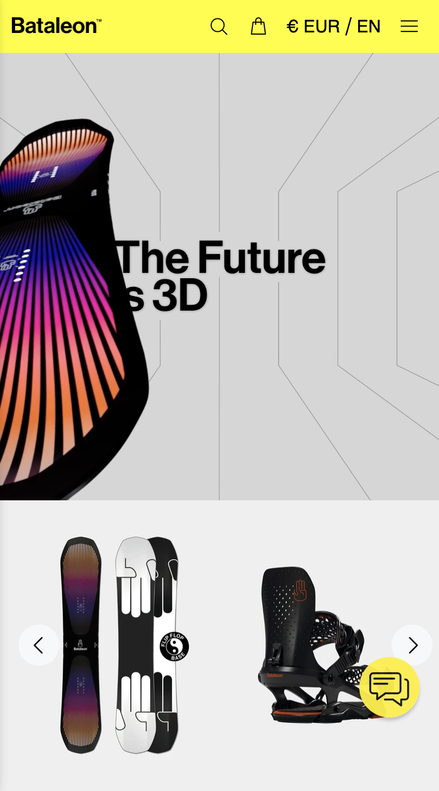
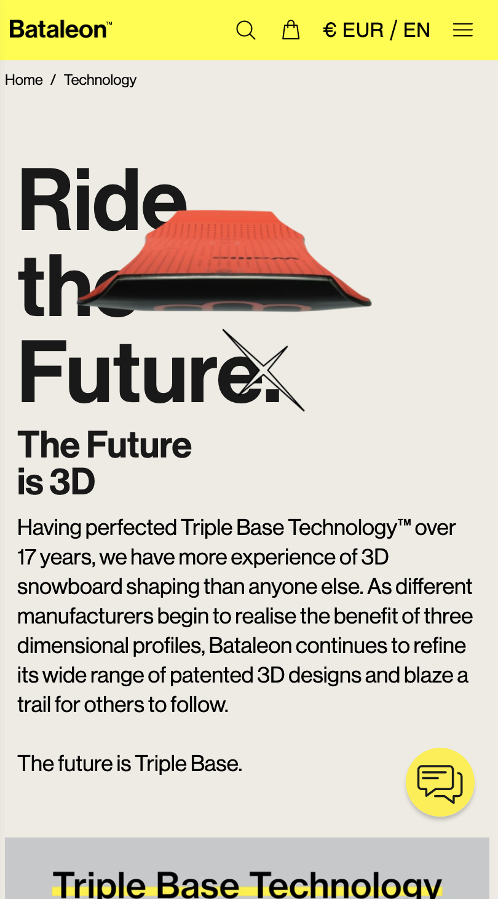
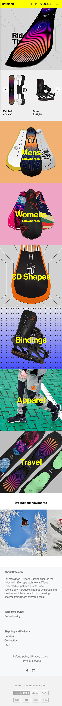
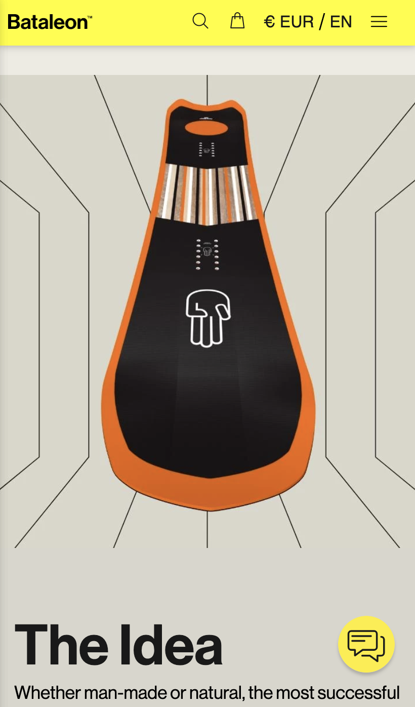
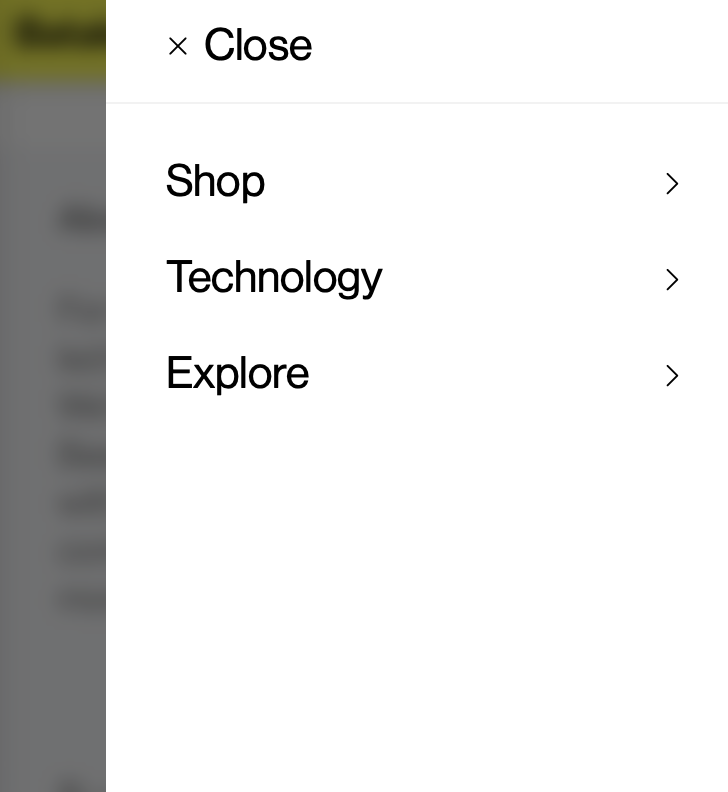
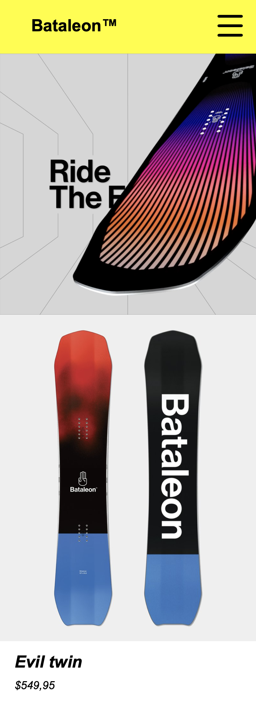
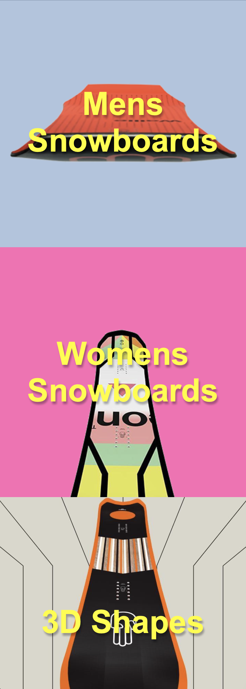
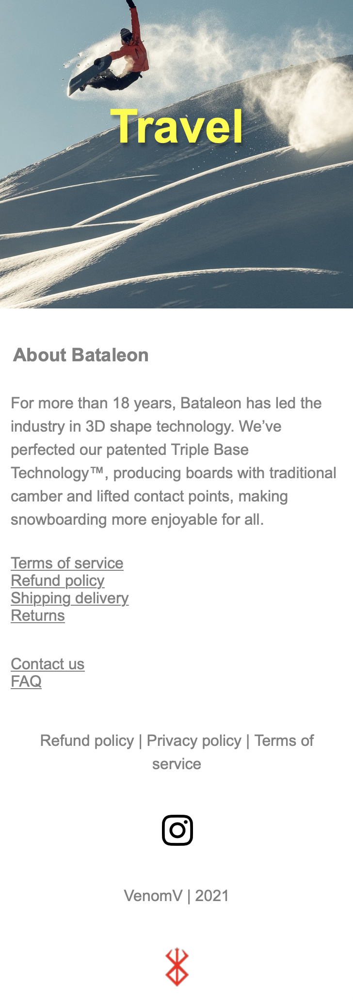
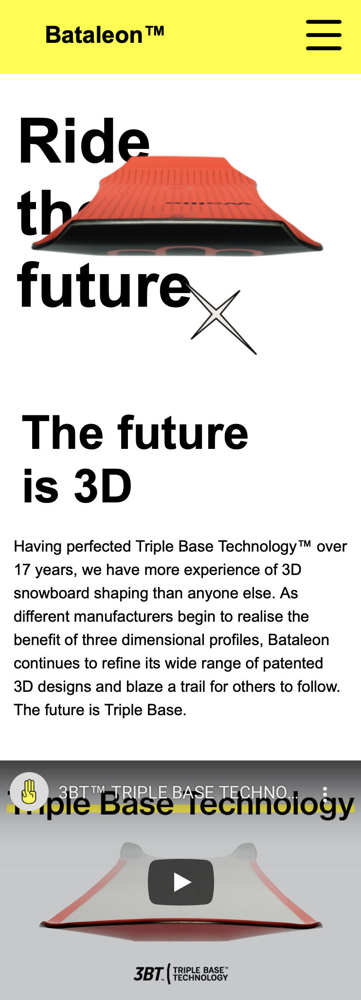
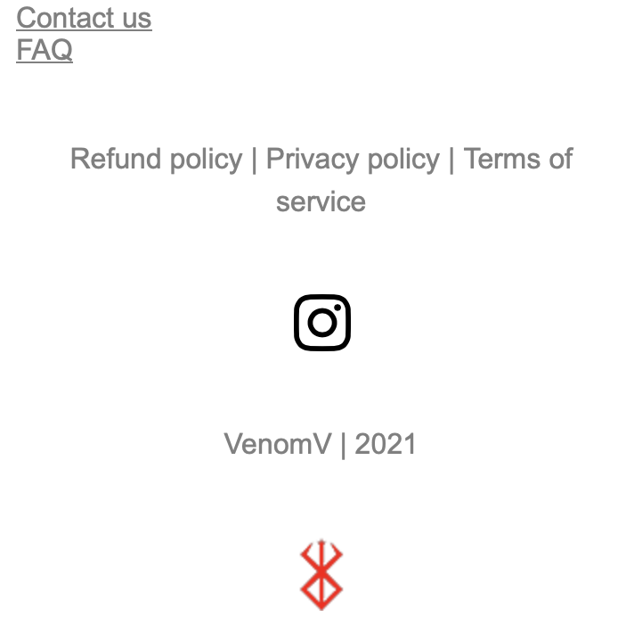

# Procesverslag
Markdown is een simpele manier om HTML te schrijven.  
Markdown cheat cheet: [Hulp bij het schrijven van Markdown](https://github.com/adam-p/markdown-here/wiki/Markdown-Cheatsheet).

Nb. De standaardstructuur en de spartaanse opmaak van de README.md zijn helemaal prima. Het gaat om de inhoud van je procesverslag. Besteedt de tijd voor pracht en praal aan je website.

Nb. Door *open* toe te voegen aan een *details* element kun je deze standaard open zetten. Fijn om dat steeds voor de relevante stuk(ken) te doen.

## Jij

uitwerken voor kick-off werkgroep

### Auteur:
Jim Jansen

#### Je startniveau:
Blauw

#### Je focus:
Surface plane

## Je website

uitwerken voor kick-off werkgroep

### Je opdracht:
[Bataleon.eu](https://eu.bataleon.com)

#### Screenshot(s) van de eerste pagina (small screen): 
Bataleon home\

#### Screenshot(s) van de tweede pagina (small screen):
hier de naam van de pagina\

## Breakdownschets (week 1)

uitwerken na afloop 2e werkgroep

### de hele pagina:
Bataleon home full\

### dynamisch deel (bijv menu):
Dynamisch onderdeel\

### wellicht nog een dynamisch deel (bijv filter): 

## Voortgang 1 (week 2)

uitwerken voor 1e voortgang

### Stand van zaken
Beetje lastige start om te kijken waar ik nu ging beginnen en omdat het al een tijdje geleden was dat ik hier aan gewerkt heb. Verder wel zin om te beginnen.

### Agenda voor meeting
samen met je groepje opstellen

We hebben niet echt vragen voor de meeting.

### Verslag van meeting
We raakte tijdens de meeting wel aan de praat maar we waren nog in een te vroeg stadium voor diepere vragen denk ik. Waarschijnlijk komt dit volgende week wel of in de loop van aankomende week.

## Voortgang 2 (week 3)

uitwerken voor 2e voortgang

### Stand van zaken
Ik had wat moeite met nth-of-type toepassen en sommige paragrafen en headers deden maar niet wat ik wilde. Bleek dat ik mijn footer op een regel na
in mijn main had staan en dat is nu net waar je dan uren overheen kijkt. Ben nu een start 

### Agenda voor meeting
 Nogmaals geen vragen voor de meeting. We gingen liever tijdens de call in gesprek en dan kijken of er wat ter sprake kwam.

### Verslag van meeting
We hebben bij elkaar gekeken, iedereen had de eerste pagina zo goed als af, misschien nog een paar kleine dingetjes die gedaan moesten worden maar 90% stond er en gaf een goed beeld van hoe het eruit zou komen te zien.

Wat vragen over div's en classes
:nth-of-type zat op mijn li en niet op de img, waardoor mijn patroon niet meer klopte.

## Toegankelijkheidstest (week 4)

uitwerken na test in 8e voortgang

### Bevindingen
Met verschillende brillen was het effect meer vervelend voor alles en niet per se mijn site. Met de low contrast had ik meer moeite de html export vinden op Visual studio code dan het lezen van mijn teksten. Ook was de Parkinson test opvallend in zijn gebruik.

#### Titel eerste bevinding
Parkinson is iets wat ik dus echt nooit van me leven zou willen hebben, maar denk dat iedereen het daar mee eens is. De lichte stand was opzich nog wel te hendelen
en ik kon prima scrollen en websites gebruiken. ik kan me voorstellen op een mobile device met touch dat het dan moeilijker wordt om kleine gestures of interacties te gebruiken. De hogere standen waren echt totaal niet te doen en ik klikte eigenlijk op alles behalve wat ik wilde. Je verwijderde nog net je system32 niet. 

Parkinson verhelp je niet, maar rekening houden met grotere knoppen en zo min mogelijk gefriemel zou mensen met de ziekte enorm helpen. Om hovers of klikbare elementen op een div of li te zetten ipv de h2,3, enz kan daarbij helpen.

#### Titel tweede bevinding.
Bij de screenreader test werd ik langzaam gek. Eerst stond mijn voice assist op chinees en werd alles heel krom  met een accent uitgesproken en zei ze de getallen in het Chinees. (Wel wat geleerd nu). Ik heb het wel gelaten want het downloaden van andere stemmen duurt blijkbaar heel lang. Als ik niks deed en de voice assist haar ding liet doen las ze keurig alles op van mijn website, ik had de alt tekst bij mijn elementen goed ingevuld en die werden goed opgelezen, ik had alleen zelf niet echt goed door hoe ik kon navigeren omdat ik voice assist nooit gebruik. 

Om dat op te lossen moet je gewoon zorgen dat je je alt tekst op orde hebt en vanuit de gebruikers zijn of haar kant een goed werkende en ingestelde screenreader.

#### Titel volgende bevinding. 
Van de brillen was die met de zwarte vlek in het midden het ergste. Ik kan er natuurlijk omheen kijken want het blijft niet in het midden van mijn zicht. Ik heb zo goed mogelijk geprobeerd niet om de stip heen te kijken maar toen besefte ik buiten mijn scherm ook niks meer kon.

De screenreader functie is dus de beste optie.

#### Titel nog een bevinding. 
Contrast viel me bij een paar afbeeldingen en achtergronden op. Geel is soms lastig te lezen bepaalde kleuren en dat gebruik ik op de homepage vooral. Het is niet altijd te lezen en daarom heb ik met de contrast checker gekeken wat nu wel of niet kon.

Niet iedere kleur past echt helemaal, maar ik wilde wel een interessante site hebben qua kleuren ipv alles hetzelfde.

## Voortgang 3 (week 4)

uitwerken voor 3e voortgang

### Stand van zaken
We hadden dit keer wel vragen (eindelijk) over bepaalde elementen uit onze sites die niet aangesproken werden, ik had bijvoorbeeld iets met afbeeldingen wat niet werkte en we hebben daar kort over gesproken om het op te lossen. Ook waren we allemaal nog niet heel ver met de tweede pagina, maar daar hadden we wel hoop voor dat het goed kwam.

### Agenda voor meeting
Onze groepschat ziet er zo uit:
yo hebben jullie vragen?
"nee niet echt, we kijken wel"

### Verslag van meeting
hier na afloop snel de uitkomsten van de meeting vastleggen

Afbeeldingen met (odd) werken nu wel bij mij

## Eindgesprek (week 5)

uitwerken voor eindgesprek

### Stand van zaken
Ik kon niet veel laten zien aan Vasilis in ons eerste gesprek. Mijn upload naar Github werkte niet en hij kon dus niks beoordelen. In een tweede gesprek zijn we nog naar mijn site wezen kijken en heb ik er daarna aan gewerkt. Ik heb extra onderdelen toegevoegd en wat onderdelen verbeterd.

### Screenshot(s)

## Bronnenlijst

continu bijhouden terwijl je werkt

1. hamburger menu https://codepen.io/shetty-tejas/pen/gORPZdy
2. hamburger menu animatie https://www.sliderrevolution.com/resources/css-hamburger-menu/ (specifiek: https://codepen.io/ainalem/pen/LJYRxz)
3. styling ideëen https://html-css-js.com/css/generator/box-shadow/

